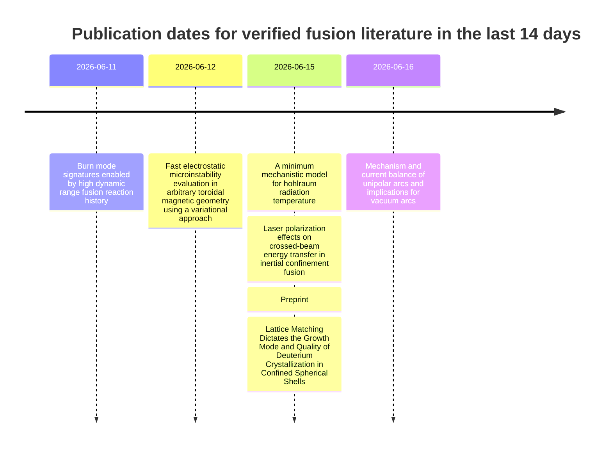

*No fluff, all facts.*

---
## Companies

[Helion announced that it had received two Washington Department of Health licenses for Orion](https://www.helionenergy.com/newsroom/helion-clears-key-regulatory-milestone-on-the-path-to-building-and-operating-the-worlds-first-fusion-power-plant). The company said the licenses let it continue building and operating what it describes as the world’s first fusion power plant in Malaga, Washington. The update is material because it moves Helion from siting and permitting into a more advanced regulatory position tied directly to plant construction and operations.

## People

[Avalanche Energy appointed Mustally Hussain had been appointed chief financial officer](https://www.avalanchefusion.com/news-release/avalanche-energy-appoints-mustally-hussain-as-chief-financial-officer). He will oversee finance, capital planning, corporate development, and investor relations as Avalanche scales commercialization of its compact fusion systems. [Mustally](https://www.linkedin.com/in/mustally/) has a background in banking, moved into finance/stragegy at National Grid, led finance in auto lending at Hyundai America and Herc Rentals and then Lucid Motors a few months after it de-SPAC'd, and a short stint at a huminoid Robotics. The energy+auto background makes sense based on Avalanche's plans for (impossible) small-scale mobile fusion platforms. And the post de-SPAC experience may be useful for the public rumors of [Avalanche's IPO apirations](https://www.axios.com/pro/climate-deals/2026/05/27/avalanche-energy-jefferies-fusion-ipo).

[TAE Technologies hired Jeff Woodbury had joined as president and chief operating officer](https://tae.com/tae-technologies-appoints-jeff-woodbury-as-president-and-coo/). TAE said the hire expands leadership as it advances commercial development, including construction of its first utility-scale fusion power plant. [Jeff](https://corporate.exxonmobil.com/news/news-releases/2018/0601_exxonmobil-jeff-woodbury-retires-neil-hansen-elected-vice-president-investor-relations-and-secy) had 35 years of service at Exxon Mobil. TAE was able to entice him back to work after 8 years of retirement. 

[Bernard Looney has joined the Type One Energy board of directors](https://typeoneenergy.com/insights-announcements/type-one-energy-appoints-bernard-looney-to-board-of-directors/). [Bernard](https://www.linkedin.com/in/bernardlooney/) worked his way up from Drilling Engineer to CEO at BP. 

General Fusion announced on June 15, 2026 that [its joint Form F-4 with Spring Valley Acquisition Corp. III had been declared effective by the SEC](https://generalfusion.com/post/general-fusions-joint-f-4-with-spring-valley-acquisition-corp-iii-in-connection-with-proposed-business-combination-declared-effective-by-sec/). The company said the SEC effectiveness occurred on June 12 and advances the transaction toward a shareholder vote and closing, after which the combined company is expected to trade on Nasdaq as GFUZ. This is a material public-market milestone because it moves General Fusion’s de-SPAC process into its final stages.

Tokamak Energy and Furukawa Electric announced on June 15, 2026 that [they were advancing collaboration on UK high-temperature-superconducting tape capability](https://www.furukawaelectric.com/en/release/2026/metal_20260615.html). The companies said they are exploring how UK-based HTS tape capability could support future demand from fusion and other advanced industrial uses, and Furukawa’s release said the effort had letters of support from the UK government and UK Fusion Energy. For Tokamak Energy, this is a supply-chain and industrial-capacity update with direct relevance to fusion magnet deployment.

Commonwealth Fusion Systems was reported in a June 14, 2026 arXiv preprint, [“Impact of energetic alpha particles on core turbulence in an ARC-class fusion power plant”](https://arxiv.org/html/2606.15965v1), co-authored by researchers including a Commonwealth Fusion Systems affiliate. The simulation study reported that fast alpha-driven modes in an ARC-class design could significantly suppress inner-core turbulence and that the effect scaled favorably with alpha density and plasma beta. Because the paper is a preprint and not an operational result, it is best read as a company-specific design and modeling update rather than a demonstrated hardware milestone.

TAE Technologies and Trump Media & Technology Group filed a June 10, 2026 [merger update on Form 8-K and Rule 425 materials](https://www.sec.gov/Archives/edgar/data/1849635/000114036126024735/ef20075853_8k.htm). The filing said the parties remained focused on completing their previously announced merger as soon as possible, with a target of the fourth quarter of 2026 or sooner. This qualifies as a material public-market update because it resets transaction timing in an active deal involving a major fusion company.

Xcimer Energy announced on June 10, 2026 that [the U.S. Department of Energy had formally approved its preconceptual design and technology development roadmap milestone for Athena](https://xcimer.energy/news/u-s-department-of-energy-approves-xcimers-fusion-power-plant-preconceptual-design-and-technology-roadmap-milestone/). Xcimer said the approval covers its fusion power-plant architecture and marks completion of a key milestone under the DOE fusion development framework. That makes the update both company-specific and non-trivial, because it bears directly on the maturity of Xcimer’s path to a commercial laser-fusion plant.

Avalanche Energy announced on June 10, 2026 that [its Jyn compact fusion plasma device had reached measured apparent ion temperatures above 1 keV](https://www.avalanchefusion.com/news-release/avalanche-energy-achieves-measured-apparent-ion-temperatures-above-1-kev-in-compact-fusion-experiment). The company said the result corresponds to roughly 11 million degrees Celsius and was measured in a device less than five inches in diameter, with supporting methods described in an external technical review. The milestone matters because Avalanche framed it as validation of its rapid-iteration approach to practical, manufacturable compact fusion systems.

- On June 18, 2026, [FERC launched targeted action to speed large-load integration](https://www.ferc.gov/news-events/news/ferc-launches-aggressive-targeted-action-speed-large-load-integration). The Commission issued show-cause orders to all six RTOs/ISOs under its jurisdiction on how tariffs handle data centers, manufacturers, and other very large loads, including co-located configurations. This matters to fusion because first-of-a-kind plants aimed at large industrial or AI loads will face the same rules on queueing, cost allocation, service terms, and speed-to-power.

- On June 18, 2026, [ERCOT’s monthly update recorded the PUCT’s approval of the Batch Zero process for large-load interconnections](https://www.ercot.com/files/docs/2026/06/19/ERCOT-Monthly-May-2026.pdf). The new process is meant to study and stage very large customer connections so that only loads with sufficient maturity and commitment move forward in a way the grid can support. This matters to fusion because Texas is a plausible early market for fusion plants serving data centers or industrial campuses, and Batch Zero changes the economics and timing of large-load siting and interconnection.

- On June 18, 2026, [Elementl Power said it will pursue a utility-scale advanced nuclear plant in southeast Ohio using GE Vernova Hitachi’s BWRX-300](https://www.prnewswire.com/news-releases/elementl-power-developing-utility-scale-advanced-nuclear-power-project-in-southeast-ohio-302804339.html). The project is planned at up to 1.5 GW and comes with site control and grid-connection work in PJM. This matters to fusion because it adds another clean-firm competitor for future data-center and industrial demand while extending a fission siting, supply-chain, and development template that fusion projects will need to beat or reuse.

- On June 17, 2026, [CORE POWER launched a feasibility study with BWXT to assess mPower SMRs for floating nuclear power plants](https://www.corepower.energy/news-resources/core-power-launches-assessment-of-bwxt%E2%80%99s-mpower-smr-for-floating-nuclear-power-plants). The study covers marine integration, regulatory pathway, product requirements, and techno-economic analysis for shipyard-built floating plants intended for high-demand locations with grid or land constraints. This matters to fusion because it is a credible alternative delivery model for clean firm power near ports, heavy industry, and dense load centers, and it validates off-site modular construction and repeatable deployment logic that could cross over into fusion projects.

- On June 16, 2026, [the NRC finalized a fee rule aimed at increasing cost certainty and lowering barriers for nuclear energy projects](https://www.nrc.gov/sites/default/files/cdn/doc-collection-news/2026/26-066.pdf). The rule sets fixed caps on many licensing and service fees and lowers some costs for prospective applicants, making early-stage regulatory budgeting more predictable. This matters to fusion because it sets a fresh precedent on how regulators can reduce first-of-a-kind development friction and perceived project-risk premiums for emerging nuclear technologies.

- On June 18, 2026, [the NRC proposed rule changes to accelerate advanced nuclear fuel infrastructure](https://www.nrc.gov/sites/default/files/cdn/doc-collection-news/2026/26-067.pdf). The proposal would streamline parts of fuel-cycle and materials licensing, including pathways relevant to advanced reactor fuels and related facilities. This matters to fusion because it strengthens the competitive position of advanced fission in clean firm power while also showing a live example of regulatory modernization around enabling infrastructure rather than only around the reactor itself.

- On June 12, 2026, [Hitachi Energy India said it will invest INR 2,000 crore to expand transformer manufacturing capacity and talent](https://www.hitachienergy.com/in/en/news-and-events/press-releases/2026/06/hitachi-energy-india-to-invest-inr-2000-crore-to-expand-transformer-manufacturing-capacity-and-talent-base). The announcement points to more production capacity for a component family that has become a system-level bottleneck for grid expansion and large-load energization. This matters to fusion because transformer lead times can become gating items for early plants, especially for sites targeting grid interconnection, large auxiliary loads, or dedicated power delivery to industrial customers.

- On June 17, 2026, [Hitachi Energy announced the acquisition of Canduct, a specialist in transformer bushings and insulation systems](https://www.hitachienergy.com/us/en/news-and-events/press-releases/2026/06/hitachi-energy-expands-global-footprint-in-critical-grid-components-with-canduct-acquisition). The deal expands Hitachi Energy’s footprint in a narrow but critical category of high-voltage components that often constrain transformer manufacturing and delivery. This matters to fusion because balance-of-plant electrification depends on the same high-voltage component ecosystem, and tighter vertical integration at major suppliers can either ease or reshape procurement conditions for fusion projects.

- On June 22, 2026, [Fervo Energy said it is working with PNNL and NVIDIA on a new digital-twin platform for geothermal development](https://fervoenergy.com/newsroom-2/). The platform is described as combining real-time field data, physics-based modeling, and AI on accelerated computing to improve infrastructure performance and power generation. This matters to fusion because the same workflow stack is directly transferable to fusion commissioning, controls, anomaly detection, and predictive maintenance in plants where operational learning speed will be strategic.

- On June 16, 2026, [Keysight said it had completed the acquisition of VPIphotonics and folded system-level simulation into its photonic design automation portfolio](https://www.keysight.com/us/en/about/newsroom/news-releases/2026/0616_pr26-082-keysight-expands-photonic-design-automation-portfolio-with-system-level-simulation.html). The combined workflow now runs from device physics through full optical-link behavior, including electrical-to-optical-to-electrical simulation and test alignment. This matters to fusion because high-power laser systems, optical diagnostics, and photonic links all benefit from faster closed-loop design and validation across device, subsystem, and system levels.

- On June 19, 2026, [Siemens released Simcenter FLOEFD 2606 with new electronics-cooling and EDA-automation capabilities](https://blogs.sw.siemens.com/simcenter/simcenter-floefd-2606-whats-new/). The release adds efficient modeling of hundreds or thousands of die-level power sources, improved PCB thermal analysis, reusable validated libraries, and headless EDA-bridge automation. This matters to fusion because pulsed-power cabinets, controls electronics, diagnostics racks, and plant power electronics all need dense thermal design and qualification workflows that can reduce hardware iteration and shorten commissioning cycles.

- On June 12, 2026, [Vertiv completed its acquisition of ThermoKey to expand heat-rejection and heat-exchange capacity for AI data centers](https://www.vertiv.com/en-us/about/news-and-events/corporate-news/2026/vertiv-completes-acquisition-of-thermokey-expanding-heat-rejection-portfolio-for-ai-data-centers/). Vertiv said the deal strengthens manufacturing and engineering capability across the thermal chain for high-density computing, including heat-exchange solutions and dry coolers. This matters to fusion because secondary-loop cooling, heat rejection, and exchanger sourcing sit in the same industrial supply stack, so growth in AI infrastructure can both mature that vendor base and intensify competition for scarce thermal hardware.

- On June 17, 2026, [PsiQuantum broke ground in Australia on the site for its utility-scale quantum computer, which will include a large cryoplant and cryogenic cabinets](https://www.psiquantum.com/news-import/psiquantum-breaks-ground-in-australia-on-site-of-worlds-first-utility-scale-quantum-computer). The company said the cryoplant, being built by Linde Engineering, will be among the largest ever built for quantum computing and will support a phased utility-scale system. This matters to fusion because it is a real, near-term scale-up of cryogenic infrastructure, semiconductor-photonic integration, and cryogenic operations talent outside fusion, with direct implications for supplier capacity, learning curves, and competition for specialized equipment.

Date range checked: June 9, 2026 to June 22, 2026 for updates; June 22, 2026 to July 6, 2026 for events and deadlines.

The Fusion Supply Chain Trade Show is a dedicated fusion-industry event organized by the Fusion Industry Association in Santa Fe, New Mexico. FIA used its official LinkedIn output on June 19, 2026 to push the event as imminent, while the official trade-show page says the event runs on June 23–24 and that exhibitor booths are sold out even as admission registration remains open. That puts both the in-window organizer update and the in-window event dates on official organizer-owned sources. It matters because this is a pure-play fusion supply-chain meeting rather than a generic energy conference, with exhibits, site visits, and industry-and-government participation focused on commercial fusion build-out. citeturn10search0turn41view3 References: [FIA LinkedIn update](https://www.linkedin.com/company/fusion-industry-association), [official event page](https://www.fusionindustryassociation.org/fusion-supply-chain-trade-show/)

“Stress-Testing Europe’s Path Towards Commercial Fusion Energy Deployment – Aligning EU and National Approaches” is a June 23 Brussels policy event organized by the Fusion Industry Association and Clean Air Task Force as part of EU Sustainable Energy Week. FIA’s official LinkedIn posts in the last few days promoted the session as taking place “next week,” and the organizer’s event page confirms the event title, organizers, and its fusion-specific policy focus. The event falls on June 23, 2026, inside the lookahead window, and the update falls inside the lookback window through FIA’s official social channel. It matters because the session is explicitly about commercial fusion deployment strategy in Europe, not a generic clean-energy panel with a stray fusion mention. citeturn10search2turn10search5turn41view2 References: [FIA LinkedIn update](https://www.linkedin.com/posts/fusion-industry-association_fusionenergy-eusew2026-energypolicy-activity-7473425754706358272-w7oI), [official event page](https://www.fusionindustryassociation.org/event/stress-testing-europe-path-towards-commercial-fusion-energy-deployment/)

The “2026 Fusion Energy for Canada” forum is a one-day fusion strategy and technical-capability event organized by the Canadian Association of Physicists’ Division of Plasma Physics and the Center for Fusion Energy at the University of Ottawa. CAP’s official LinkedIn page carried an organizer post three days before June 22 stating that registration was open and that the event would take place on June 22, while the official event page gives the date, program, and a speaker list that explicitly includes inertial and magnetic confinement fusion as well as ITER, LLNL, Commonwealth Fusion Systems, General Fusion, Stellarex, and Type One Energy. The event date is June 22, 2026, which is inside the lookahead window, and the official social update falls inside the lookback window. It matters because the forum is explicitly framed around Canada’s fusion strategy, domestic capability, and supply chain, with public-sector, academic, and commercial fusion participants all on the official program. citeturn39view0turn42view0turn42view1turn42view2turn42view3 References: [CAP LinkedIn update](https://ca.linkedin.com/company/canadian-association-of-physicists-association-canadienne-des-physiciens-et-physiciennes), [official event page](https://cap.ca/congress-conference/congress2026/fusion-energy-forum/)

The Tritium Users Group Conference is a fusion-fuel-cycle meeting organized by UKAEA at Culham Campus in Oxfordshire. In its officially published LinkedIn newsletter on June 19, 2026, UKAEA said that registration for the Tritium Users Group conference was now live, and UKAEA’s event listings show the conference running on June 30–July 1, 2026. That satisfies the two-window test: the organizer-owned update is inside the lookback period, and the event itself is inside the lookahead period. It matters because the conference is explicitly about tritium operations, processing, storage, waste, radiological protection, and safety assessments — all core fusion fuel-cycle issues. citeturn29view0turn33search4 References: [UKAEA newsletter update](https://www.linkedin.com/pulse/welcome-latest-uk-atomic-energy-authority-newsletter-ukaeaofficial-xirse?trk=organization_guest_main-feed-card_feed-article-content), [UKAEA events page](https://www.ukaea.org/events/)

- 2026-06-09 — United States / Department of Energy released its finalized Fusion Science and Technology Roadmap and said it will be implemented through DOE’s new Office of Fusion. This matters because the roadmap turns federal fusion commercialization into an explicit national program of work by setting infrastructure, workforce, supply-chain, public-private partnership, and pilot-plant priorities that DOE says will guide collaboration with industry, universities, and national labs, even though future support remains subject to appropriations. [DOE release](https://www.energy.gov/articles/energy-department-releases-finalized-fusion-science-and-technology-roadmap-accelerate)

- 2026-06-10 — United Kingdom / UK Atomic Energy Authority committed £20 million more to the UK Innovation & Science Seed Fund’s fusion portfolio. This matters because it is direct government-backed risk capital for early-stage fusion-relevant spinouts and enabling technologies, with UKAEA framing the fund as a commercialization vehicle for areas such as high-temperature superconducting magnets and taking the wider Space, Defence and Fusion sub-funds to £150 million of capacity. [UKAEA press release](https://www.gov.uk/government/news/ukaea-commits-20m-to-uki2s-fund-for-fusion-innovation)

- 2026-06-11 — Japan / QST announced that ITER had asked it to take on an additional paid task arrangement for welding and cutting tools needed for temporary plugs in ITER’s initial assembly, after earlier Japanese work on blanket-assembly tooling. This matters because it expands Japan’s paid industrial role in ITER construction and strengthens domestic capabilities in fusion assembly, remote handling, and plant-maintenance tooling that are directly relevant to future commercial reactor buildouts. [QST press release](https://www.qst.go.jp/site/press/20260611.html)

- 2026-06-12 — European Union / Fusion for Energy published an €18.066 million contract notice for the manufacture of three cryopumps for the ITER Heating and Diagnostic Neutral Beam system. This matters because cryopumps are major vacuum and exhaust components for ITER’s neutral-beam systems, so the tender creates a concrete public procurement opportunity in a high-value fusion hardware segment and pushes European industrial capability deeper into commercially relevant fusion supply chains. [F4E contract notice](https://industryportal.f4e.europa.eu/f4e-calls?ref=383b25eb-34fe-4bc6-9fc6-ced523ea558c)

- 2026-06-16 — United Kingdom and Japan / UKAEA and QST signed a Memorandum of Cooperation covering breeding blankets, plasma science, materials, plant systems engineering, robotics, tritium technologies, regulation, standards, skills, affordability, and commercial viability. This matters because it is not just a diplomatic signal: the agreement sets up a government-backed framework for targeted collaborative projects, shared facilities, and deployment-enabling work in precisely the fuel-cycle, plant-integration, and regulatory areas that sit on the critical path to commercial fusion plants. [UKAEA press release](https://www.gov.uk/government/news/uk-japan-fusion-partnership-strengthened-by-ukaea-and-qst)

- 2026-06-22 — European Union / Fusion for Energy published a €359.3 million contract notice for design, procurement, manufacturing, qualification, installation, testing, and commissioning of mechanical systems plus associated electrical and instrumentation-and-control works in the ITER Tokamak Complex and surrounding buildings. This matters because it is a very large public fusion construction package tied to core plant systems, with clear consequences for industrial capacity, systems integration, and the European contractor base that will be needed for future fusion facilities beyond ITER. [F4E contract notice](https://industryportal.f4e.europa.eu/f4e-calls?ref=8df45c4-e948-484c-8180-2272333f3fca)

Date range: 2026-06-09 to 2026-06-22 (inclusive).

## People moves

[TAE Technologies appoints Jeff Woodbury as President and COO](https://tae.com/tae-technologies-appoints-jeff-woodbury-as-president-and-coo/). TAE announced on June 17, 2026 that Jeff Woodbury joined as President and Chief Operating Officer. The company framed the hire as commercial-scale execution leadership for its first utility-scale fusion power plant, citing Woodbury’s large-scale energy, capital-project, and operating experience at Exxon Mobil.

[Type One Energy appoints Bernard Looney to its board](https://typeoneenergy.com/insights-announcements/type-one-energy-appoints-bernard-looney-to-board-of-directors/). Type One Energy announced on June 16, 2026 that former bp CEO Bernard Looney joined its Board of Directors as an independent board member. The company tied the appointment directly to commercialization, procurement, project delivery, and scaling its Infinity fusion plant program.

[Inertia forms a Science and Technology Advisory Board chaired by Marvin Adams](https://www.globenewswire.com/news-release/2026/06/18/3314239/0/en/global-fusion-leaders-join-inertia-advisory-board-to-advance-its-path-to-commercial-fusion-energy.html). Inertia announced on June 18, 2026 that it created a Science and Technology Advisory Board to review its physics, target, laser, and power-plant programs, with Marvin Adams as chair. The release presents the move as a formal addition of senior external technical oversight as the company pushes toward commercial inertial fusion.

[American Fusion adds Robert V. Duncan as an independent scientific and strategic advisor](https://americanfusionenergy.com/news/american-fusion-inc-otc-amfn-appoints-dr-robert-v-duncan-as-independent-scientific-and-strategic-advisor/). American Fusion announced on June 17, 2026 that Robert V. Duncan agreed to serve as an Independent Scientific and Strategic Advisor. The company explicitly linked the appointment to development, testing, commercialization, government engagement, and technical review of its fusion platform.

## Jobs

[Helion posted a fresh cluster of fusion-engineering roles on its company jobs page](https://www.linkedin.com/company/helion-energy/jobs). On the Helion company jobs page opened on June 22, 2026, visible relative dates showed new postings ranging from 11 hours to 6 days old, including Senior Process Engineer, Fuel Cycle; Senior Computational Plasma Scientist; Principal Experimental Scientist, RF; Knowledge Systems Engineer, Fusion Systems; Senior Plasma Data Scientist; Senior Manufacturing Engineer; and Manufacturing Engineer. Date evidence is mirror-based from LinkedIn Jobs.

[Thea Energy posted new stellarator-control and diagnostics roles](https://www.linkedin.com/company/thea/jobs). On the Thea Energy company jobs page opened on June 22, 2026, visible relative dates showed Instrumentation Systems Engineer, Embedded Systems Engineer, Electronics Hardware Design Engineer, and Control Systems Engineer all at 23 hours old, plus Director, Diagnostics; Senior Plasma Control Engineer; and engineering technician roles at 5 days old. Date evidence is mirror-based from LinkedIn Jobs, and the roles are consistent with Thea’s official careers presence.

[Type One Energy posted new plant and tritium hiring within the window](https://www.linkedin.com/company/type-one-energy/jobs). On the Type One Energy company jobs page opened on June 22, 2026, visible relative dates showed Senior Design Integration Engineer and Quality Engineer at 3 days old; Lead Integrated Master Scheduler, Tritium Engineer, Senior Power Systems Electrical Engineer, Multiphysics Modeling Engineer, and Supplier Quality Engineer at 4 days old; and Senior Director of Engineering, Balance of Plant at 5 days old. Date evidence is mirror-based from LinkedIn Jobs.

[Pacific Fusion posted Senior Structures Engineer for its fusion demonstration system](https://www.fusionenergybase.com/jobs/3200). A Fusion Energy Base job page opened for Pacific Fusion showed Senior Structures Engineer in Fremont, California, posted 9 days ago, with the role explicitly tied to steel structures integral to the company’s fusion demonstration system. Date evidence is mirror-based from Fusion Energy Base, and the role is corroborated by Pacific Fusion’s official careers page and Greenhouse board.

[Commonwealth Fusion Systems posted Senior Manager, Process Engineering](https://www.fusionenergybase.com/jobs/3206). A Fusion Energy Base page showed Commonwealth Fusion Systems posting Senior Manager, Process Engineering in Milpitas, California, with a visible in-window posted date of 7 days ago. The role sits in superconductor R&D and is central to fusion industrialization. Date evidence is mirror-based from Fusion Energy Base.

[Commonwealth Fusion Systems posted Materials Test Engineer, Electrical](https://www.fusionenergybase.com/jobs/3172). A Fusion Energy Base page showed Commonwealth Fusion Systems posting Materials Test Engineer, Electrical in Somerville, Massachusetts, with a visible in-window posted date of 11 days ago. The role is tied to fusion materials and electrical testing. Date evidence is mirror-based from Fusion Energy Base.

[General Fusion posted diagnostic, plasma, and systems roles around LM26](https://www.fusionenergybase.com/jobs/3279). Opened Fusion Energy Base pages showed General Fusion posting Diagnostic Physicist at 2 days old, Diagnostic Physicist, Thomson Scattering at 18 hours old, Plasma Physicist at 6 hours old, and Systems Engineer at 9 days old. The descriptions tie the work directly to LM26 and magnetized-target-fusion power-plant development. Date evidence is mirror-based from Fusion Energy Base.

[Xcimer posted Capacitor Assembly Technician Lead for laser-fusion manufacturing](https://www.fusionenergybase.com/jobs/3155). A Fusion Energy Base page showed Xcimer posting Capacitor Assembly Technician Lead in Tucson, Arizona, with a visible posted date of 12 days ago. The description ties the role directly to capacitor production for Xcimer’s inertial-fusion laser architecture. Date evidence is mirror-based from Fusion Energy Base.

[Proxima Fusion posted Chief of Staff, Systems Architecture](https://www.fusionenergybase.com/jobs/3169). A Fusion Energy Base page showed Proxima Fusion posting Chief of Staff, Systems Architecture in Munich with a visible posted date of 7 days ago. The description ties the role directly to stellarator systems architecture and commercially viable fusion power plants. Date evidence is mirror-based from Fusion Energy Base.

[Proxima Fusion posted R&D Engineer, Pellet Injectors](https://www.fusionenergybase.com/jobs/3180). A Fusion Energy Base page showed Proxima Fusion posting R&D Engineer, Pellet Injectors in Munich with a visible posted date of 10 days ago. The role is explicitly tied to stellarator fusion R&D. Date evidence is mirror-based from Fusion Energy Base.

[Realta Fusion posted Lead Fusion Controls Developer](https://www.fusionenergybase.com/jobs/3245). A Fusion Energy Base page showed Realta Fusion posting Lead Fusion Controls Developer in Madison with a visible posted date of 4 days ago. Date evidence is mirror-based from Fusion Energy Base, and the role is corroborated by Realta’s official careers page.

[Oak Ridge National Laboratory posted Fusion Program Manager](https://www.fusionenergybase.com/jobs/3197). An opened Fusion Energy Base page showed ORNL posting Fusion Program Manager with a visible date of June 13, 2026 and “posted 4 days ago” on the captured page. The description makes the role explicitly responsible for ORNL’s nuclear fusion portfolio, including strategy, execution, and industry engagement. Date evidence is mirror-based from Fusion Energy Base.

[Lawrence Livermore National Laboratory posted Inertial Confinement Fusion Chief Engineer](https://www.fusionenergybase.com/jobs/3138). A Fusion Energy Base page showed LLNL posting Inertial Confinement Fusion Chief Engineer with a visible posted date of 4 days ago. The role is explicitly tied to the ICF science portfolio and the National Ignition Facility. Date evidence is mirror-based from Fusion Energy Base.

[Princeton Plasma Physics Laboratory posted Experimental Devices Group Lead](https://www.fusionenergybase.com/jobs/2509). An opened Fusion Energy Base page showed PPPL posting Experimental Devices Group Lead with a visible timestamp of 6/10/2026 9:34 AM. The description ties the role directly to magnetized-plasma research devices and NSTX-U operations. Date evidence is mirror-based from Fusion Energy Base.

Trump Media’s [Form 8-K tied to the TAE merger](https://www.sec.gov/Archives/edgar/data/1849635/000114036126024735/ef20075853_8k.htm) is the clearest in-window securities-law update on the TAE public-markets process. It furnishes a merger-status press release, states that the parties remain focused on closing the TAE transaction on the revised timetable, and, just as important, records that TMTG, TAE, and Texas Ventures Acquisition III have stopped pursuing the previously discussed spin-off of Truth Social and other media assets. For diligence, this matters because it narrows deal structure, resets expectations around post-closing asset separation, and updates the filed record on transaction sequencing, governance discretion, and litigation-risk framing.

Spring Valley’s [Rule 425 communication announcing effectiveness of the General Fusion registration statement](https://www.sec.gov/Archives/edgar/data/2074850/000110465926074098/tm2617985d1_425.htm) is the key legal step moving the General Fusion de-SPAC from registration into active solicitation. The filing states that the joint Form F-4 was declared effective, that the definitive proxy statement was filed and mailed, and that Spring Valley fixed the record date and shareholder meeting for the merger vote. It also confirms the contemplated post-closing name and ticker changes. For investors, boards, lenders, and expert-witness work, this is the formal transition from preliminary disclosure to a live shareholder-approval process.

Spring Valley’s [separately filed Rule 425 transcript of General Fusion’s Web Summit keynote](https://www.sec.gov/Archives/edgar/data/2074850/000110465926074659/tm2618107d1_425.htm) is a distinct securities-record item, not just marketing noise. By putting Greg Twinney’s presentation into the filed merger record, the parties preserved public statements about General Fusion’s commercialization thesis, claimed path to grid-ready power, liquid-lithium design logic, major technical milestones for LM26, and intended route toward a first-of-a-kind plant. That matters because filed management statements can shape diligence, disclosure comparisons, reliance disputes, and later expert analysis of what the market was formally told during solicitation.

Spring Valley’s [later Rule 425 filing of a paid PR Newswire article about the General Fusion transaction](https://www.sec.gov/Archives/edgar/data/2074850/000110465926075217/tm2618231d1_425.htm) is legally notable because it brings a sponsored market-facing article into the SEC record and preserves the compensation disclaimer and conflict language alongside the promotional claims. The article reiterates the implied pro forma valuation, PIPE and trust-capital assumptions, shareholder-vote setup, and expected listing path, while expressly warning readers not to treat the piece as investment advice. For securities-law diligence, that combination of paid promotion, conflict disclosure, and transaction detail is precisely the sort of communication that can matter later.

American Fusion CEO Richard C. Hawkins’ [Schedule 13D](https://www.sec.gov/Archives/edgar/data/96664/000107997326000817/xslSCHEDULE_13D_X02/primary_doc.xml) is an in-window control-and-ownership record with real diligence value. It reports beneficial ownership of 120,000,000 common shares, or 8.59% of the class, and identifies Hawkins as chief executive officer, secretary, and director. The filing also states that his shares were received through the reverse acquisition of Kepler Fusion and related acquisitions and that he may buy or sell depending on market conditions and company prospects. For investors and counterparties, this is a useful read on insider concentration, acquisition provenance, and future trading optionality.

Pinnacle Consulting Services’ [Schedule 13G for American Fusion](https://www.sec.gov/Archives/edgar/data/96664/000107997326000818/xslSCHEDULE_13G_X02/primary_doc.xml) is another meaningful in-window ownership filing. It reports sole voting and dispositive power over 145,149,958 common shares, equal to 8.99% of the class, and checks the Rule 13d-1(c) box rather than the passive institutional route under Rule 13d-1(b). Given American Fusion’s recent warrant-financing disclosures and thin capital position outside this window, the filing matters because it helps map who can move stock, influence financing outcomes, or become relevant in any later dispute over dilution, control, or related-party dynamics.

# Fusion Critical Supply Chain and Adjacent-Industry Monitor

## Executive summary

The strongest in-window signals were not generic fusion headlines. They were industrialization signals: DOE’s finalized commercialization roadmap, General Atomics’ move toward a full-scale blanket test facility, Helion’s state licensing milestone for Orion, ITER’s progress on cryogenic and divertor integration hardware, and a new European stellarator program with explicit enabling-technology and industrial-capability aims. A second tier of developments sat just outside fusion proper but still mattered: supplier investment and consolidation around transformers, cryogenic instrumentation, and early-stage fusion venture formation. citeturn22view0turn22view1turn36view0turn37search0turn40view0turn40view1turn31view0turn25view0turn11view0turn18news22

The main takeaway for diligence is that the market is shifting from plasma-only milestones toward balance-of-plant, blankets, tritium, cryogenics, diagnostics, grid interface, and supplier readiness. The best public evidence in this window came from authoritative primary sources, and the most useful adjacent signal was the way major suppliers and infrastructure firms are positioning for long-lead fusion and power-sector demand before reactors exist at scale. citeturn22view1turn36view0turn40view1turn25view0turn18news22

## Date range

Date range: 2026-06-09 to 2026-06-22 inclusive.

## In-window items

- [Energy Department Releases Finalized Fusion Science and Technology Roadmap to Accelerate Commercial Fusion Power](https://www.energy.gov/articles/energy-department-releases-finalized-fusion-science-and-technology-roadmap-accelerate). Category: Government, standards, and procurement signals. Confidence: High. Summary: On June 9, 2026, DOE released the finalized Fusion Science and Technology Roadmap and the underlying June 2026 roadmap document. It organizes federal action around “Build, Innovate, Grow,” and explicitly calls for infrastructure to close gaps in materials, fuel cycle and blankets, high-heat-flux systems, AI-enabled digital capability, and commercialization pathways through the mid-2030s. Fusion relevance: This is the clearest current U.S. public signal on where public money, test infrastructure, and qualification effort are likely to concentrate across the fusion industrial base. It is directly useful for mapping future demand for blanket, tritium, materials-testing, diagnostics, and digital-engineering suppliers. citeturn22view0turn22view1

- [General Atomics to Design First Full-Scale Fusion Blanket Test Facility](https://www.ga.com/ga-to-design-first-full-scale-fusion-blanket-test-facility). Category: Fusion-specific industrialization. Confidence: High. Summary: General Atomics said on June 11, 2026, that it is collaborating with DOE to develop design concepts for a Fusion Blanket Component Test Facility, with the article page showing the item in GA’s press room on June 13, 2026. GA said the facility would test full-scale blanket systems using lithium-based materials and would leverage its Magnet Technologies Center, the former site where the ITER Central Solenoid was completed, with seed DOE support routed through Idaho National Laboratory and collaboration that includes UC San Diego. Fusion relevance: Blanket qualification is one of the hardest missing links between experimental fusion devices and power plants. A credible full-scale test facility would reduce risk around heat removal, mechanical loads, and tritium-breeding system integration while creating a focal point for blanket, materials, pumps, controls, and instrumentation suppliers. citeturn36view0

- [Helion clears key regulatory milestone on the path to building and operating the world's first fusion power plant](https://www.helionenergy.com/newsroom/helion-clears-key-regulatory-milestone-on-the-path-to-building-and-operating-the-worlds-first-fusion-power-plant). Category: Fusion-specific industrialization. Confidence: High. Summary: Helion announced on June 16, 2026, that it had received a Radioactive Materials License and a Radioactive Air Emissions License from the Washington Department of Health for its Orion facility in Malaga, Washington. Helion said the licenses confirm that the site, personnel, and safety programs meet state requirements for fusion operations and allow work to proceed on Orion’s generator building while the company pursues transmission interconnection with Chelan County PUD. Fusion relevance: This is one of the strongest real-world deployment signals in the window because it moves fusion from lab-scale claims toward site-permitted operating infrastructure. It matters for investors because licensing progress changes the schedule risk around plant construction, balance-of-plant procurement, utilities coordination, and state-level regulatory precedent. citeturn37search0

- [Fusion industry suppliers bet on race for reactors creating a $73bn market](https://www.ft.com/content/73d5d6a0-31d5-458b-81fa-01dec3dd465a). Category: Supplier finance, factory capacity, and corporate moves. Confidence: Medium. Summary: Published June 14, 2026, the Financial Times reported that suppliers are already investing against expected commercial-fusion plant buildout, citing Helixos estimates of $73.1 billion in annual construction spend by 2040. The article highlights Fujikura’s investment to expand superconducting-material output, AECOM’s investment in Type One Energy, and continuing hesitation among smaller upstream suppliers because demand timing remains uncertain. Fusion relevance: The item matters less for any one reactor design than for what it says about supplier behavior: parts of the industrial base are beginning to invest ahead of firm reactor orders. That is a leading indicator for future bottlenecks in HTS materials, EPC capability, and specialized subsystem manufacturing. citeturn18news22turn18search6

- [Tokamak Assembly](https://www.iter.org/project/tokamak-assembly). Category: Plasma-facing materials and high-heat-flux systems. Confidence: High. Summary: ITER’s tokamak assembly page shows a June 15, 2026 update that the divertor integration facility in Qinshan, China, is now the point where divertor cassette assemblies will be built for installation at ITER. The same dated update states that a SWIP-led consortium will mount inner vertical targets from Europe, outer vertical targets from Japan, and divertor domes from Russia onto cassette bodies manufactured by Europe, while integrating diagnostics and operating instrumentation. Fusion relevance: This is an unusually concrete supply-chain signal for one of fusion’s hardest hardware challenges: high-heat-flux exhaust systems assembled from multinational subcomponents. It shows where integration capability is maturing, which suppliers are participating, and how diagnostics and structural hardware are being merged into plant-relevant assemblies. citeturn40view1turn40view2

- [ITER Commissioning](https://www.iter.org/project/commissioning). Category: Vacuum, cryogenics, robotics, diagnostics, and controls. Confidence: High. Summary: ITER’s commissioning page records on June 11, 2026 that commissioning of the liquid nitrogen plant was completed after successful cooldown of the two nitrogen refrigerators. ITER says the system demonstrated 1,300 kW of cooling power at 80 K and reliable performance across scenarios. Fusion relevance: Large cryogenic plants are a practical gating item for superconducting-magnet machines, cryopumps, and cold diagnostics. A successful industrial-scale commissioning milestone at ITER is a useful proxy for supplier competence, controls maturity, and reliability expectations in future fusion cryogenic balance-of-plant. citeturn40view0

- [Europe Advances Stellarator Fusion Research with the Launch of Project WISER](https://euro-fusion.org/eurofusion-news/europe-advances-stellarator-fusion-research-with-the-launch-of-project-wiser/). Category: Fusion-specific industrialization. Confidence: High. Summary: EUROfusion published the update on June 18, 2026, describing Spain’s launch of Project WISER, a roughly €500 million alliance between CIEMAT, CDTI, and Técnicas Reunidas. The project includes both construction of the WISER stellarator and the development of enabling technologies for future fusion reactors, and EUROfusion says it is expected to stimulate European industrial capability in superconducting technologies, advanced manufacturing, precision engineering, and plasma systems. Fusion relevance: This is one of the few in-window items with both scale and explicit industrial content. It matters because it expands the European hardware ecosystem beyond tokamaks and ties stellarator development to supplier capability building and proximity to IFMIF-DONES materials infrastructure. citeturn31view0

- [UKAEA commits £20M to UKI2S fund for fusion innovation](https://www.gov.uk/government/news/ukaea-commits-20m-to-uki2s-fund-for-fusion-innovation). Category: Supplier finance, factory capacity, and corporate moves. Confidence: High. Summary: Published June 10, 2026, the UKAEA said it is contributing another £20 million to the UK Innovation & Science Seed Fund portfolio to back UK spinouts and early-stage companies, taking UKAEA’s cumulative contribution to £28 million and helping expand total UKI2S capacity to £150 million across sub-funds. UKAEA explicitly linked the strategy to fusion’s shift from research toward build-and-execution and highlighted enabling technologies such as high-temperature superconducting magnets. Fusion relevance: Early-stage supplier formation is still a weak point in the fusion stack, especially for enabling hardware rather than reactor primes. This funding matters because it increases the pool of capital available to create and mature UK-based suppliers in magnets, controls, isotopes, industrial systems, and adjacent deep-tech fields that fusion will need. citeturn11view0

- [Hitachi Energy bolsters the regional transformer market with strategic investment in North America](https://www.hitachienergy.com/us/en/news-and-events/press-releases/2026/06/hitachi-energy-bolsters-the-regional-transformer-market-with-strategic-investment-in-north-america). Category: Power conversion, grid, and site infrastructure. Confidence: Medium. Summary: Hitachi Energy announced on June 17, 2026 that it had signed a definitive agreement to acquire Canduct Group, a North American manufacturer of transformer insulation kits and components. Hitachi explicitly framed the move as an effort to relieve a critical transformer-supply bottleneck, add more than 300 employees, and accelerate delivery of grid infrastructure under rising electricity demand. Fusion relevance: Fusion plants will compete for the same transformer, substation, and interconnection equipment that data centers, utilities, and other large loads now strain. A supplier move aimed at a known bottleneck is therefore relevant even without mentioning fusion, because site electrification and grid connection are part of the fusion deployment schedule. citeturn25view0

- [A divertor spectroscopic imaging diagnostic of the plasma emission being installed in JT-60SA](https://euro-fusion.org/eurofusion-news/a-divertor-spectroscopic-imaging-diagnostic-of-the-plasma-emission-being-installed-in-jt-60sa/). Category: Vacuum, cryogenics, robotics, diagnostics, and controls. Confidence: High. Summary: EUROfusion reported on June 17, 2026 that the Divertor Vacuum Ultra Violet spectrometer system for JT-60SA had completed procurement and delivery to Naka and had entered installation and initial commissioning. The article lays out a distributed European supply chain: upgraded spectrometer vessel from prior hardware, new high-resolution gratings designed in Germany, mechanical structure from Romania, vacuum hardware and CCD cameras procured by Poland, and overall optical design developed in Italy. Fusion relevance: Diagnostics supply chains are usually hard to observe from the outside, yet they are critical for divertor control, impurity monitoring, and plasma-detachment studies that future reactors will need. This item is valuable because it names institutions, subcomponents, and integration roles across a real multinational procurement and installation effort. citeturn32view0

## Search ledger

- **Source types searched:** company press releases; government and lab pages; national-lab newsrooms; industry news pages; fusion-program pages; trade and business coverage; program and project galleries with explicit dated updates; limited use of secondary trade summaries where they pointed back to primary material.
- **Search engines and databases searched:** general web search; site-specific searches across DOE, UKAEA, ITER, PPPL, EUROfusion, Helion, General Atomics, Hitachi Energy, Lake Shore, FT, ANS, and related domains.
- **Major keyword families searched:** fusion roadmap; blanket test facility; divertor integration; tritium and fuel cycle; superconducting magnets; HTS and REBCO; cryogenic plant and LN2; diagnostics and divertor spectroscopy; transformer bottlenecks; supplier investment and factory capacity; stellarator enabling technologies.
- **Critical supply-chain categories searched:** fusion-specific industrialization; blankets and tritium; magnets and superconductors; cryogenics; plasma-facing components; diagnostics; nuclear-grade qualification and materials infrastructure; grid interconnection and transformer supply; supplier finance and commercialization vehicles.
- **Procurement and government sources searched:** DOE and energy.gov pages; GOV.UK and UKAEA pages; ITER program and assembly pages; national-lab pages; selected standards and regulatory sources for fusion-rulemaking and code signals.
- **Non-fusion adjacent sectors searched:** power transformers and grid hardware; cryogenic instrumentation and cryostats; industrial EPC and infrastructure; advanced manufacturing; superconducting materials and magnet suppliers.
- **Inaccessible or weakly searchable sources:** some paywalled business coverage; some press-wire pages with thin technical detail; some procurement portals and social posts with poor search visibility or weak extractable metadata.
- **Fallback methods used:** site-specific searches; use of project galleries and newsroom indexes where dated article pages were hard to navigate; preference for primary-source pages with explicit publication dates over lower-value secondary coverage.

## Excluded near-misses

- **ITER “Final correction coils received on site.”** Excluded because the dated source is June 8, 2026, one day outside the required window even though the content is otherwise highly relevant. citeturn14view2
- **PPPL “Delivery of magnet bundle signals a new age of fusion research.”** Excluded because the primary PPPL source is dated June 8, 2026, outside the window. citeturn39view0
- **Helion Raises $465 Million Series G Funding Round to Meet Surging Global Demand for Power.** Excluded because the publication date is June 4, 2026, outside the window, despite obvious importance to manufacturing scale-up. citeturn38search0
- **UK draft National Policy Statement for fusion energy infrastructure consultation document.** Excluded because the visible date is June 8, 2026, outside the window. citeturn29search16
- **UK-Japan fusion partnership strengthened by UKAEA and QST.** Excluded because, while dated June 16, 2026 and clearly relevant, the announcement stayed at framework level and did not disclose enough new supplier, facility, qualification, or capacity detail to clear the materiality bar for this monitor. citeturn11view1
- **Arcline-Backed DwyerOmega Acquires Lake Shore Cryotronics.** Excluded from the main list because the June 10, 2026 acquisition was relevant to cryogenic and magnetic instrumentation, but the disclosed facts did not go far enough on manufacturing capacity, product qualification, or fusion-specific order flow. It remains a watch item for cryogenic test-and-measure consolidation. citeturn24view0

## Open questions and limitations

- A few relevant business items were partly paywalled. I included only the ones where publication date and load-bearing details were visible enough to support the specific claims used here.
- ITER’s June activity was rich, but several item pages were easiest to verify through dated program galleries and assembly pages rather than clean one-page article permalinks.
- I applied the date window strictly. Several strong candidates on June 8 or earlier were excluded even when they were clearly material to fusion industrialization.

# Fusion patent monitoring

## Date range

Date range: 2026-06-09 to 2026-06-22 inclusive.

## In-window patent items

- [US12658342](https://patents.justia.com/patent/12658342) — Tier 2. This is a newly granted patent for Massachusetts Institute of Technology and Commonwealth Fusion Systems LLC covering a partitioned high-temperature-superconducting cable architecture that reduces eddy-current and coupling losses in high-field magnets. It is relevant to fusion because the record ties the cable to high-field superconducting magnet operation, and the description explicitly includes a fusion power plant embodiment, making this a fusion-adjacent but materially important magnet-subsystem patent. The record shows a grant date of 2026-06-16. Source basis: patent index. Confidence note: strong bibliographic record with clear date, assignees, abstract, and explicit fusion context in the description, but no official office page was successfully opened in this run. citeturn40view0turn41view0

- [US12658329](https://patents.justia.com/patent/12658329) — Tier 2. This is a newly granted patent for Hefei Institutes of Physical Sciences, Chinese Academy of Sciences covering closed-loop control of plasma-edge fuel-particle backflow through lithium powder feedback injection in a magnetically confined fusion device. It is relevant to fusion because the claims and specification are explicitly about a magnetically confined fusion reaction device, plasma-wall interaction, divertor-region Da emission, and fuel recycling control in EAST-like tokamak operation. The record shows a grant date of 2026-06-16. Source basis: patent index. Confidence note: strong patent-index record with assignee, claims, and G21B classifications, but no official USPTO or office-derived full record was opened. citeturn6view3turn22search0turn24search2

- [US20260160598A1](https://www.patents-review.com/a/20260160598-endoscopic-plasma-monochromatic-light-analysis-system.html) — Tier 2. This is a newly published application for Hefei Institutes of Physical Sciences, Chinese Academy of Sciences covering an endoscopic monochromatic-light analysis system for remote two-dimensional spectral diagnostics of magnetically confined plasma through crowded peripheral structures. It is relevant to fusion because the record explicitly discusses tokamak devices, superconducting magnets, cryogenic structures, radiation shielding, and remote inspection/diagnostics, and it carries CPC G21B1/25. The record shows a publication date of 2026-06-11. Source basis: patent index. Confidence note: strong patent-index record with publication date, applicant, abstract, and fusion-specific classification, though no official publication PDF was opened. citeturn18view0

## Search ledger

- RUN_DATE = 2026-06-22; WINDOW_START = 2026-06-09; WINDOW_END = 2026-06-22; DISCOVERY_START = 2026-03-24.
- Sources searched: Justia patent pages and assignee pages, Patents-Review date archives and item pages, WIPO PATENTSCOPE home/search snippets, Google Patents snippets, and one office-derived commercial index used only for family/date recovery on a PCT near-miss. citeturn40view0turn18view0turn28search5turn14search0
- Official weekly publication or grant dates checked: U.S. grant Tuesdays 2026-06-09 and 2026-06-16; U.S. application Thursdays 2026-06-11 and 2026-06-18; WIPO PCT publication issue 25/2026 dated 2026-06-18. citeturn36search3turn36search0turn26search0turn28search5
- Publication weeks or issues checked: Patents-Review archive for U.S. applications published on 2026-06-11, including the page range containing US20260160598A1; PATENTSCOPE issue notice for 25/2026. citeturn26search0turn17view0turn28search5
- Date-filtered index discovery that was actually executed: repeated web searches against Justia patent pages for tokamak, magnetically confined plasma, divertor, tritium, fusion reactor, and June 2026 publication dates; assignee-page searches for Commonwealth Fusion Systems, Tokamak Energy, Helion, MIT, Innoven Energy, and Princeton. citeturn36search0turn36search1turn40view0turn31search2turn31search5turn45view0turn46search8
- Class families searched: G21B family terms were checked through item pages and index records; included hits carried G21B1/11, G21B1/13, G21B1/15, and G21B1/25. Broader superconducting-magnet and plasma-diagnostic pages were also screened for explicit fusion context. citeturn6view3turn18view0turn41view0
- Keyword families searched: nuclear fusion, fusion reactor, tokamak, stellarator, magnetically confined plasma, divertor, tritium, superconducting magnet, and related subsystem terms such as quench detection, conductive joints, plasma diagnostics, and lithium powder injection. These searches surfaced the final three in-window items and several out-of-window family members. citeturn7search2turn7search3turn40view0turn41view0
- Multilingual keyword sweep performed: Chinese, Japanese, and Korean fusion terms were tested through Google Patents-style discovery, but accessible in-window item-level records were not recovered from those sweeps during this run. citeturn38search3
- Assignee families searched: Commonwealth Fusion Systems LLC, Massachusetts Institute of Technology, Tokamak Energy Ltd., Helion Energy, Innoven Energy LLC, and The Trustees of Princeton University, plus Hefei Institutes of Physical Sciences through direct patent-page discovery. citeturn40view0turn31search2turn31search5turn45view0turn46search8turn22search0
- Family-expansion checks performed: for each included item, nearby family events or related assignee-page entries were screened to see whether another distinct in-window publication or grant existed. This found out-of-window but technically relevant family or sibling events for Commonwealth Fusion Systems and Innoven Energy, which were excluded as near-misses. citeturn40view0turn45view0
- Anti-zero checks performed: both U.S. grant Tuesdays and U.S. application Thursdays inside the window were checked through index fallbacks; a WIPO weekly issue check was run; assignee-page sweeps for major fusion applicants were run; at least one class-linked and subsystem-linked search path was used; and multiple fallback indexes were used when official pages were inaccessible or impractical. citeturn36search0turn36search1turn28search5turn40view0turn45view0
- Official sources that were inaccessible, blocked, rate-limited, or not practically searchable: PATENTSCOPE detail pages frequently returned 403 or stalled on initialization; Google Patents search URLs could not be opened directly through safe-URL restrictions; USPTO, Espacenet, CNIPA, J-PlatPat, and KIPRIS were not practically searchable through the available browsing path in this session. citeturn12view0turn12view1turn9view0turn9view1turn9view2
- Fallback sources used: Justia Patents and Patents-Review were the main item-level sources for included records; PATENTSCOPE snippets and an office-derived IP index were used only for out-of-window family/date checks. citeturn18view0turn22search0turn14search0turn14search1
- Material search limitations: no official patent-office record was successfully opened for the included items, so all included items are Tier 2 rather than Tier 1; June 18 U.S. application discovery was weaker than June 11 because accessible indexed pages were sparse; and several non-U.S. official databases could not be searched deeply in-session.

## Excluded near-misses

- WO2026064411, **Partial ionization plasma centrifuge for fusion power**, Marathon Fusion, Inc. — excluded for out-of-window date. Accessible records show a PCT publication date of 2026-03-26, well before the monitoring window, even though the technology is clearly fusion-relevant. citeturn14search0turn14search1
- US20260147151, **Dense linear ramp Bragg grating pattern for quench detection in high temperature superconducting magnets**, Commonwealth Fusion Systems LLC — excluded for out-of-window date. The assignee page shows a publication date of 2026-05-28; technically material and fusion-adjacent, but outside the final window. citeturn40view0
- US20260148880, **Techniques for forming a conductive joint between superconducting cables and related systems and methods**, Commonwealth Fusion Systems LLC — excluded for out-of-window date. The assignee page shows a publication date of 2026-05-28; plausible fusion-magnet relevance, but not in-window. citeturn40view0
- US20260148867, **Systems, Methods and Apparatus of an Experimental Nuclear Fusion Reactor having a Hollow Toroidal Interior Chamber with a Rifled Interior Surface that is Operable to Form an Electromagnetic Foil Along a Ridge of the Rifled Interior Surface** — excluded for out-of-window date. The accessible record showed a publication date of 2026-05-28, outside the monitoring window. citeturn6view4
- US12555692, **Reflectivity variation of ICF target surfaces**, Innoven Energy LLC — excluded for out-of-window date. The assignee page shows a grant date of 2026-02-17; technically relevant to inertial confinement fusion, but too early for inclusion. citeturn45view0
- US20250322971, **Tailoring the Pushing Profile of an ICF Target with a Dense Propellant Region**, Innoven Energy LLC — excluded for out-of-window date. The assignee page shows a publication date of 2025-10-16, so it is outside this run despite clear ICF relevance. citeturn45view0
- Tokamak Energy Ltd. assignee-page entries such as **Machine learning in fusion reactors** and **HTS magnet quench initiation system** — excluded for out-of-window dates. The accessible assignee page showed no Tokamak Energy publication or grant inside 2026-06-09 through 2026-06-22. citeturn31search2
- Helion Energy, Inc. assignee-page entries such as **Apparatus and methods for generating a pulsating, high-strength magnetic field** — excluded for out-of-window dates. The accessible assignee page showed no Helion publication or grant inside the monitoring window. citeturn31search5
- Biomea Fusion, Inc. and Premia Spine Ltd. “fusion” records — excluded for non-nuclear use of the word “fusion.” These surfaced during assignee discovery but were unrelated to nuclear fusion technology. citeturn46search5turn46search1

- [Helion clears key regulatory milestone](https://www.reuters.com/business/energy/helion-says-it-is-first-us-fusion-energy-firm-clear-regulatory-licenses-2026-06-16/) Helion said on June 16 that it had become the first U.S. fusion developer to secure all required regulatory licenses for its planned power plant in Malaga, Washington. What is genuinely new this fortnight is not a concept paper or site-prep update, but a concrete permitting milestone on the path to building and operating a commercial fusion facility. That matters because it de-risks the regulatory path for early fusion projects and gives investors, hyperscalers, utilities, and major suppliers a clearer signal that first-of-a-kind licensing can move. The key limitation is that licensing progress does not settle the larger questions around technical performance, cost, or on-time delivery.

- [DOE releases finalized fusion roadmap](https://www.energy.gov/articles/energy-department-releases-finalized-fusion-science-and-technology-roadmap-accelerate) The U.S. Department of Energy released its finalized Fusion Science and Technology Roadmap on June 10, setting out a national strategy for materials and technology infrastructure, advanced research and AI-enabled development, and commercialization support. The genuinely new development is the shift from draft vision to finalized federal roadmap, which gives the U.S. fusion enterprise a more explicit policy and program frame. That matters because it can shape grant logic, procurement priorities, lab work, supply-chain planning, and the public-private agenda that investors and developers will use to judge U.S. momentum. The qualification is that a roadmap is direction, not a funding round or a plant approval.

- [Tennessee fusion regulations take effect](https://www.ans.org/news/article-8115/tennessee-fusion-regulations-take-effect/) Tennessee’s state-level fusion regulations took effect on June 9, making it the first U.S. state to implement its own regulatory framework for fusion machines. What is new within the window is the rules’ actual entry into force, not just prior discussion of them, and the step is directly relevant to Type One Energy’s proposed project near Oak Ridge. That matters because a real state rulebook changes the permitting path for developers, utilities, and infrastructure partners considering where early fusion plants can plausibly be built. The main caveat is that state rules still sit within a wider federal regulatory setting that is not fully mature.

- [DOE approves Xcimer’s laser fusion plant design](https://www.ans.org/news/2026-06-10/article-8111/doe-approves-xcimer-laser-fusion-power-plant-design/) Xcimer said the Department of Energy had approved the preconceptual technical design and technology roadmap for its Athena inertial-fusion power plant concept. The important new fact this fortnight is that Xcimer cleared a formal DOE milestone tied to plant-design credibility, moving beyond broad ambition into a government-reviewed development stage. That matters because it strengthens the commercialization case for laser fusion, improves Xcimer’s standing in the DOE milestone system, and gives suppliers and financiers a clearer sign that inertial approaches are still in the serious race. The limitation is that this is a design and roadmap approval, not a proof of net-electric operation.

- [General Atomics announces breeding blanket test facility work](https://www.ans.org/news/2026-06-15/article-8122/general-atomics-announces-breeding-blanket-test-facility/) General Atomics said it is working with DOE on design concepts for a Fusion Blanket Component Test Facility that would test full-scale breeding blankets. The genuinely new development this fortnight is the move to define a dedicated facility for one of fusion’s hardest commercialization bottlenecks: systems that must both capture heat and breed tritium fuel. That matters because blanket validation is central to plant readiness, and a serious test program would help developers, materials suppliers, and public funders judge whether fusion designs can move from plasma physics to durable power systems. The qualification is that the effort is still at the design-concept stage.

- [UKAEA commits £20M to UKI2S fund for fusion innovation](https://www.gov.uk/government/news/ukaea-commits-20m-to-uki2s-fund-for-fusion-innovation) The UK Atomic Energy Authority said on June 10 that it had committed £20 million to the UK Innovation & Science Seed Fund portfolio to support early-stage fusion and deep-tech companies emerging from UK research. What is new within the window is a fresh public capital commitment aimed at turning research output into investable companies and technologies. That matters because it improves the financing base for start-ups and suppliers that sit below headline reactor developers but are needed for a functioning fusion industrial stack. The limitation is that the money is ecosystem capital rather than a named award to a specific commercial plant project.

- [China expands IPO support to “future industries” including fusion](https://www.reuters.com/legal/government/china-support-ipos-by-future-industry-startups-large-model-companies-2026-06-17/) Chinese authorities said on June 17 that they would support capital-market access for “future industry” startups, explicitly including nuclear fusion, through updated listing arrangements for strategically important but unprofitable firms. The genuinely new development this fortnight is a policy move that widens potential public-market financing channels for fusion-linked companies in China. That matters because access to domestic capital is a decision variable in a field where commercialization depends on long-duration funding, and it signals that fusion is being treated as part of China’s industrial-policy contest in advanced energy. The key limitation is that no specific fusion company, financing, or project award was announced alongside the policy.

# Fusion research published in the last 14 days

## Executive summary

Using a strict publication window of **June 9 through June 22, 2026** in America/New_York, and counting only items whose publisher or repository page showed an in-window publication or release date, I verified **five peer-reviewed journal articles** and **one clearly labeled, high-quality preprint** relevant to fusion. All five verified journal articles came from **Physics of Plasmas**. In the other major fusion and fusion-adjacent venues that were accessible in-session, the latest surfaced content on journal homepages was older: **Fusion Engineering and Design** and **Journal of Nuclear Materials** showed April 2026 latest-published items, while **Nuclear Materials and Energy** and **High Energy Density Physics** showed March 2026 latest-published items. Accessible **Plasma and Fusion Research** items that looked fusion-relevant were released on **March 31, 2026** and **May 19, 2026**, outside the target window. Direct crawling of **IOP** journal pages, **APS** recent pages, and **Taylor & Francis** journal pages was restricted during this session, so the report is best read as a **strictly verified corpus**, not as a mathematically complete census of every gated publisher database. citeturn64view0turn55view0turn56view0turn57view0turn50view0turn36view0turn37view0turn58view0turn22view0turn25view0

The verified journal window leaned heavily toward **inertial confinement fusion**. Three of the five peer-reviewed papers dealt with ICF diagnostics, hohlraum modeling, or crossed-beam energy transfer; one paper addressed **magnetic-confinement plasma-facing component physics** through unipolar-arc theory; and one paper addressed **magnetic-confinement transport modeling** through a new reduced microinstability framework for arbitrary toroidal geometry. The most important near-term theme was not a new ignition shot or reactor milestone, but a cluster of papers aimed at **better reduced-order models and better diagnostics** for existing fusion experiments. citeturn16view1turn41view0turn41view1turn15view0turn64view0turn19view0

The five most important articles in this window were these:

- **Burn mode signatures enabled by high dynamic range fusion reaction history** — the clearest paper in the set on what improved ICF diagnostics could reveal about burn propagation, pre-ignition compression, and rebounding shocks. citeturn16view1turn42view1turn44view3
- **Fast electrostatic microinstability evaluation in arbitrary toroidal magnetic geometry using a variational approach** — a potentially useful reduced model for design and optimization loops in tokamaks and stellarators. citeturn64view0turn19view0
- **Laser polarization effects on crossed-beam energy transfer in inertial confinement fusion** — relevant because it links polarization choice to CBET nonuniformity and backscatter risk in NIF-like conditions. citeturn41view1turn42view0
- **A minimum mechanistic model for hohlraum radiation temperature** — notable for compressing hohlraum radiation-temperature prediction into a very simple ODE-based model while retaining agreement with experiments and simulations from the literature. citeturn41view0
- **Mechanism and current balance of unipolar arcs and implications for vacuum arcs** — important for magnetic-confinement wall interactions because it reframes how unipolar arcs can be sustained at plasma-facing components. citeturn15view0

## Scope and search coverage

I applied the user’s strict rule: **only articles published or officially online within the last 14 days**, and I excluded older material even when it was prominent or highly relevant. For peer-reviewed literature, that meant requiring a date on the publisher page itself when possible. For preprints, I required a clearly labeled repository page and an in-window posting date. citeturn15view0turn41view0turn41view1turn16view1turn64view0turn67view0

The search covered major fusion and plasma venues that were reachable in-session. **Physics of Plasmas** yielded all five verified journal hits in the window. By contrast, the “latest published” sections on **Fusion Engineering and Design**, **Journal of Nuclear Materials**, **Nuclear Materials and Energy**, and **High Energy Density Physics** surfaced March or April 2026 content rather than June 2026 content. In **Plasma and Fusion Research**, accessible article pages that looked fusion-relevant were released on March 31 and May 19, both outside the window. citeturn64view0turn55view0turn56view0turn57view0turn50view0turn36view0turn37view0

Three access limits matter for interpretation. First, direct crawling of **IOP Science** journal pages was blocked by robots rules in this session, which limited direct verification on **Nuclear Fusion** and **Plasma Physics and Controlled Fusion**. Second, the **APS** recent page returned a 403 error. Third, the **Taylor & Francis** journal page for **Fusion Science and Technology** also returned a 403 error. Those restrictions do not change the verified corpus below, but they do mean that some additional in-window papers may have existed behind inaccessible publisher surfaces. citeturn58view0turn22view0turn25view0

## Verified corpus

### Peer-reviewed journal articles

| Title | Authors | Journal | DOI or stable identifier | Publication timestamp shown on source | Article type | Fusion pathway relevance | Funding, conflicts, data/code | Source |
|---|---|---|---|---|---|---|---|---|
| *Burn mode signatures enabled by high dynamic range fusion reaction history* | K. D. Meaney; R. H. Dwyer; B. M. Haines; W. Daughton; H. Geppert-Kleinrath; J. Sauppe; R. Lester; D. Schlossberg; J. Carrera; E. Mariscal; Y. Kim | *Physics of Plasmas* | 10.1063/5.0324190 | June 11, 2026 | Research article | **ICF** | Funding: U.S. DOE via LANL; LLNL contract support also stated. COI: none disclosed. Data: available on reasonable request. Code: unspecified. | citeturn16view1turn42view1turn44view3 |
| *Fast electrostatic microinstability evaluation in arbitrary toroidal magnetic geometry using a variational approach* | M. C. L. Morren; P. Mulholland; J. H. E. Proll; M. J. Pueschel; L. Podavini; D. D. Kiszkiel; J. A. Schuurmans; A. Zocco | *Physics of Plasmas* | Journal DOI not surfaced on accessible publisher page in-session; matching stable preprint identifier: arXiv:2512.05678 | June 12, 2026 on publisher homepage; matching preprint posted Dec. 5, 2025 | Research article | **MCF** — tokamaks and stellarators | Funding: unspecified on accessible pages. COI: unspecified. Data/code: unspecified on accessible pages. | citeturn64view0turn19view0turn65view3 |
| *A minimum mechanistic model for hohlraum radiation temperature* | Jingxiang Shen; Ke Lan | *Physics of Plasmas* | 10.1063/5.0334747 | June 15, 2026 | Research article | **ICF** — indirect drive hohlraums | Funding: unspecified on accessible page. COI: unspecified. Data/code: unspecified. | citeturn41view0turn61view4 |
| *Laser polarization effects on crossed-beam energy transfer in inertial confinement fusion* | P. Michel; A. Oudin; N. Lemos; E. Kur; A. Kritcher; T. Chapman | *Physics of Plasmas* | 10.1063/5.0335309 | June 15, 2026 | Research article | **ICF** — NIF-relevant laser-plasma interaction physics | Funding: unspecified on accessible page. COI: unspecified. Data/code: unspecified. | citeturn41view1turn42view0turn61view2 |
| *Mechanism and current balance of unipolar arcs and implications for vacuum arcs* | André Anders | *Physics of Plasmas* | 10.1063/5.0325093 | June 16, 2026 | Research article | **MCF** — plasma-facing components and arc erosion | Funding: unspecified on accessible page. COI: unspecified. Data/code: unspecified. | citeturn15view0turn61view0turn61view3 |

### Eligible new preprint

| Title | Authors | Venue | DOI or stable identifier | Publication timestamp shown on source | Article type | Fusion pathway relevance | Funding, conflicts, data/code | Source |
|---|---|---|---|---|---|---|---|---|
| *Lattice Matching Dictates the Growth Mode and Quality of Deuterium Crystallization in Confined Spherical Shells* | Peng Bi; Yu-Shen Wan; Wei Zhang; Jian Chen; Yong Yi; Qi-Feng Chen | arXiv preprint | arXiv:2606.16550; 10.48550/arXiv.2606.16550 not surfaced on the short page but arXiv ID is stable | Mon. June 15, 2026, 10:52:15 UTC | Preprint | **ICF** — cryogenic DT target fabrication by proxy via D\(_2\) | Funding: unspecified on accessible page. COI: unspecified. Data/code: unspecified. | citeturn67view0turn24academia1 |

## Methods and reported results

The verified publication dates cluster tightly between **June 11 and June 16, 2026**, with the single eligible preprint also posted on **June 15, 2026**. citeturn16view1turn64view0turn41view0turn41view1turn15view0turn67view0

| Article | Core methods | Main findings | Reported experimental result or milestone | Relevance bucket | Source |
|---|---|---|---|---|---|
| *Burn mode signatures…* | Fusion hot-spot theory plus ICF simulations; analysis of what higher-dynamic-range fusion reaction history would reveal | Shows that extending diagnostic dynamic range from roughly one decade toward \(10^3\) could expose distinct burn stages, propagation signatures, and pre-ignition compression behavior in layered, double-shell, and OMEGA-scale implosions | No new experimental shot is reported, but the paper identifies concrete diagnostic observables and facility-use cases for NIF and OMEGA | ICF diagnostics and burn physics | citeturn42view1turn44view3 |
| *Fast electrostatic microinstability evaluation…* | Semi-analytical variational dispersion relation in arbitrary toroidal geometry; benchmarked against linear gyrokinetic simulations | Produces a reduced electrostatic model for ITG and TEM growth in tokamaks and low-shear stellarators, with good agreement against higher-fidelity linear gyrokinetic cases | Computational milestone rather than experimental one; the point is speed and geometry generality for optimization loops | MCF theory and optimization | citeturn19view0turn64view0 |
| *A minimum mechanistic model for hohlraum radiation temperature* | Two coupled ODEs with explicit Marshak-wave treatment and one calibrated dimensionless material parameter | Compresses laser-to-radiation-temperature mapping into a very low-order model that still matches a diverse literature set of experiments and simulations | No new campaign milestone; the contribution is a fast forward/inverse design model for indirect drive | ICF hohlraum modeling | citeturn41view0 |
| *Laser polarization effects on CBET…* | Analytical two-beam CBET theory plus simulations under NIF-relevant conditions | Finds that CBET both depends on and alters beam polarization; circular polarization tends to reduce azimuthal in-cone variation while keeping overall CBET similar | No new NIF campaign is reported, but the paper ties polarization choice to symmetry and stimulated Brillouin scattering risk in driver design | ICF laser-plasma interaction physics | citeturn42view0 |
| *Mechanism and current balance of unipolar arcs…* | Analytical synthesis of prior models and literature data on spot plasma, double layers, and return currents | Argues that high-density expanding spot plasma and elevated electron temperature can sustain the necessary electron return current in unipolar arcs; links unipolar-arc and vacuum-arc behavior more tightly | No new experiment; conceptual milestone for plasma-facing component failure and erosion physics | MCF plasma-material interaction | citeturn15view0 |
| *Lattice Matching Dictates the Growth Mode…* | Large-scale molecular dynamics using a Feynman-Hibbs-corrected Silvera-Goldman potential | Finds lattice matching near the equilibrium HCP spacing of cryogenic D\(_2\) yields coherent layer-by-layer growth and smoother inner target surfaces, while mismatch leads to polycrystals and roughness | No experiment yet; the milestone is an atomistic design rule for cryogenic target fabrication | ICF target fabrication preprint | citeturn67view0 |

## Article analyses

### Burn mode signatures enabled by high dynamic range fusion reaction history

**Bibliographic note.** *Physics of Plasmas* published this as a **Research Article** on **June 11, 2026**. The DOI is **10.1063/5.0324190**. citeturn16view1turn42view1

The paper asks what fusion physicists would learn if gamma-reaction-history diagnostics could see much more of the burn waveform than they do now. The authors combine hot-spot theory with a set of ICF simulations and argue that higher dynamic range would separate distinct burn stages that are mostly collapsed together in current measurements. For cryogenic layered implosions, they say the method could reveal burn propagation details and changing hot-spot conditions. For double-shell and OMEGA-scale implosions, they argue it could expose late compression and rebounding-shock behavior before ignition. citeturn42view1

This is the strongest paper in the window because it sits at the intersection of **diagnostics, interpretation, and campaign utility**. Its novelty is not a new shot result, but a more discriminating lens for reading old and future shots. The main limitation is that the result stops short of demonstrating the upgraded diagnostic in operation; the paper itself acknowledges that background environment and detector configuration remain practical constraints. Even so, if the proposed dynamic range can be fielded, the paper could sharpen how NIF- and OMEGA-class facilities distinguish among undercompression, mistimed shocks, and burn-propagation failure modes. citeturn42view1turn44view3

**Funding, conflicts, and availability.** The work states support from the **U.S. Department of Energy** through **Los Alamos National Laboratory**, notes LLNL contract preparation, declares **no conflicts of interest**, and says the supporting data are available from the corresponding author on reasonable request. Code availability is not specified. citeturn44view3

### Fast electrostatic microinstability evaluation in arbitrary toroidal magnetic geometry using a variational approach

**Bibliographic note.** The *Physics of Plasmas* homepage lists this as a **Research Article** dated **June 12, 2026**. In-session retrieval of the article’s own publisher landing page failed, so the most stable accessible identifier here is the matching preprint **arXiv:2512.05678**. citeturn64view0turn19view0

The paper develops a semi-analytical dispersion-relation framework for the two electrostatic microinstabilities that matter most in many core-plasma transport problems: **ITG** and **TEM**. The model is built for **arbitrary toroidal geometry**, which matters because transport optimization increasingly spans both shaped tokamaks and modern stellarators. The authors say the scheme keeps key drift resonances and nonlocal field-line effects while remaining much cheaper than full linear gyrokinetics. They then benchmark it against high-fidelity linear gyrokinetic simulations and report good quantitative agreement across tokamak and low-magnetic-shear stellarator cases. citeturn19view0turn64view0

This is the most important **magnetic-confinement modeling** paper in the window. Its novelty lies in offering a geometry-flexible reduced model that is substantially more practical for optimization loops than direct gyrokinetic solves. The paper’s main limitations are also clear: it is explicitly **electrostatic** and **collisionless**, so it is not a full transport model and does not yet substitute for nonlinear turbulence calculations in reactor-relevant regimes with finite \(\beta\), collisionality, or electromagnetic instabilities. Even so, as a fast screening layer for stellarator and tokamak design, it could be quite influential. citeturn19view0

**Funding, conflicts, and availability.** These were **not specified on the accessible publisher homepage snippet**, and the arXiv abstract page does not surface them either. Data and code are likewise unspecified on the pages I could access in this session. citeturn64view0turn65view0turn65view1turn65view2

### A minimum mechanistic model for hohlraum radiation temperature

**Bibliographic note.** *Physics of Plasmas* published this as a **Research Article** on **June 15, 2026**. The DOI is **10.1063/5.0334747**. citeturn41view0

This paper introduces a deliberately stripped-down model for the mapping between time-dependent laser power and hohlraum radiation-temperature pulse. Instead of relying on a phenomenological albedo rule alone, it explicitly solves the underlying **Marshak-wave** propagation and closes the problem with just **two ODEs**. Material behavior is compressed into a single dimensionless parameter, calibrated against one reference re-emission factor. The authors report that this very low-order model still agrees well with a varied set of hohlraum experiments and simulations from the literature, and that it supports both forward and inverse design mapping. citeturn41view0

The attraction of this paper is speed. Indirect-drive design still suffers from a gap between “fast but crude” and “accurate but expensive” tools, and this work tries to sit squarely in that gap. Its main limitation is just as obvious: the simplicity is bought by calibration and self-similar assumptions, so the model may not remain accurate in regimes with strong departures from the assumed temperature structure or more complicated material behavior. Still, for preliminary design scans and machine-learning-generated design-space exploration, it looks useful. citeturn41view0

**Funding, conflicts, and availability.** The accessible page did not surface a funding statement, conflict declaration, or data-availability note. I therefore mark all three as **unspecified** on the source I could access. citeturn41view0turn61view1turn61view4

### Laser polarization effects on crossed-beam energy transfer in inertial confinement fusion

**Bibliographic note.** *Physics of Plasmas* published this as a **Research Article** on **June 15, 2026**. The DOI is **10.1063/5.0335309**. citeturn41view1turn42view0

The paper studies **crossed-beam energy transfer**, a central laser-plasma interaction in indirect-drive ICF, and focuses on how beam polarization changes both CBET and the beam state itself. The authors derive analytical expressions for two-beam CBET with linearly and circularly polarized light and run simulations under conditions relevant to the **National Ignition Facility**. Their central result is that CBET mixes polarization as beams propagate and drives azimuthal power imbalances within a beam cone. They also report that circularly polarized light preserves similar overall CBET while reducing those azimuthal variations and likely lowering stimulated Brillouin scattering risk. citeturn42view0

This is a strong, design-relevant paper because it takes a knob that laser designers actually control — polarization — and ties it to two things that matter operationally: symmetry and backscatter. The limitation is that the paper does not present a new experimental campaign showing net target-performance improvement under the proposed polarization choice. So the result is best seen as **decision-useful physics** rather than a demonstrated facility optimization. Even so, it could matter for next-generation driver architectures and for updated operating points on large laser facilities. citeturn42view0

**Funding, conflicts, and availability.** The accessible page did not surface funder names, conflict declarations, or formal data/code statements. I therefore mark them as **unspecified** on the accessible source. citeturn41view1turn61view2

### Mechanism and current balance of unipolar arcs and implications for vacuum arcs

**Bibliographic note.** *Physics of Plasmas* published this as a **Research Article** on **June 16, 2026**. The DOI is **10.1063/5.0325093**. citeturn15view0

This single-author paper revisits **unipolar arcs**, which ignite and burn between plasma-facing components and the plasma, and links them to the physics of vacuum arcs. The key argument is that the combination of **dense expanding spot plasma** and **high local electron temperature** can supply the electron return current needed to sustain the arc. Taking the traveling double layer of the expanding plasma into account, the author argues that the electron return current can exceed the net arc current in the vacuum-arc case, while ion current to the surface plays only a minor role. The whole argument is anchored in analytical reasoning and prior experimental literature rather than new measurements. citeturn15view0

This is the most directly relevant paper in the set for **plasma-facing component damage and erosion** in magnetic confinement systems. Its novelty is conceptual: it tries to reconcile several strands of arc modeling and sharpen the analogy between unipolar and vacuum arcs. That is also the main limitation. Because it is not a new experiment or first-principles simulation campaign, the paper is more likely to redirect interpretation and future experiment design than to change engineering practice on its own. Still, for tokamak wall physics, it is useful and timely. citeturn15view0

**Funding, conflicts, and availability.** No funding source, conflict declaration, or data/code statement was surfaced on the accessible page. I therefore mark these as **unspecified**. citeturn15view0turn61view0turn61view3

### Lattice Matching Dictates the Growth Mode and Quality of Deuterium Crystallization in Confined Spherical Shells

**Bibliographic note.** This is a **preprint**, not a peer-reviewed journal paper. The arXiv posting date is **Mon. June 15, 2026, 10:52:15 UTC**. citeturn67view0

The preprint addresses a practical ICF target problem: how to grow cryogenic fuel layers with high smoothness and low defect density inside spherical shells. Using large-scale molecular dynamics with a **Feynman-Hibbs-corrected Silvera-Goldman potential**, the authors study deuterium crystallization as a proxy for DT target fabrication. Their central finding is that **substrate lattice matching** governs whether growth is coherent and epitaxial or breaks into rougher polycrystalline islands. Near a 3.5 Å match to the equilibrium HCP spacing of cryogenic D\(_2\), they report coherent layer-by-layer growth, lower dislocation density, and smoother inner surfaces. citeturn67view0

As a preprint, this should be treated cautiously, but it is one of the more interesting new ideas in the window because fabrication quality remains a hard constraint on ICF symmetry. The novelty is in turning an old materials intuition — lattice matching — into a targeted atomic design rule for cryogenic fusion capsules. The limitation is equally clear: the study is simulation-based, uses D\(_2\) as a model system, and has not yet demonstrated the same result in fabricated DT targets. If later validated, though, it could influence inner-surface engineering for cryogenic capsules. citeturn67view0

**Funding, conflicts, and availability.** The accessible arXiv page did not surface funding, conflict, data, or code statements. I therefore mark them as **unspecified**. citeturn67view0

## Coverage gaps and excluded candidates

Two additional *Physics of Plasmas* papers looked highly relevant but were **excluded from the main verified table** because the accessible source in-session showed only a **June 2026** month marker or a homepage teaser, not a fully retrievable article page with a complete publisher-side metadata record. Those were **Machine learning for electron-scale turbulence modeling in W7-X** and **A flexible and differentiable coil proxy for stellarator equilibrium optimization**. Both are clearly fusion-relevant and both have matching arXiv preprints, but I could not secure the same level of publisher-page verification that I could for the five main journal entries above. citeturn28view0turn30academia0turn30academia1

One article that looked relevant but fell **outside** the window was **Wetted-foam target stability for laser-direct-drive inertial confinement fusion**, which the *Physics of Plasmas* homepage dated **June 2, 2026**. I excluded it on that basis. Likewise, accessible **Plasma and Fusion Research** articles that were fusion-relevant were released on **March 31, 2026** and **May 19, 2026**, so they were also excluded. citeturn64view0turn36view0turn37view0

The most important caveat is publisher access. Because the session could not directly crawl **IOP** pages for **Nuclear Fusion** and **Plasma Physics and Controlled Fusion**, and because **APS** and **Taylor & Francis** recent-page access also failed, I cannot rule out the existence of other in-window journal articles in those venues. What I can say with confidence is that, under the strict publisher-side verification standard applied here, the accessible corpus in the last 14 days was **small, concentrated, and dominated by Physics of Plasmas**, with the sharpest new work centered on **ICF modeling and diagnostics** rather than on a fresh experimental breakeven milestone. citeturn58view0turn22view0turn25view0turn64view0
